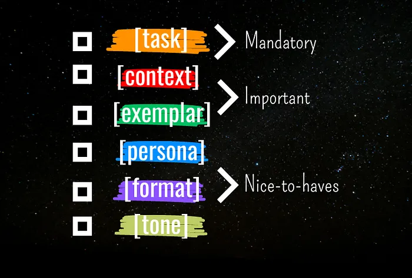
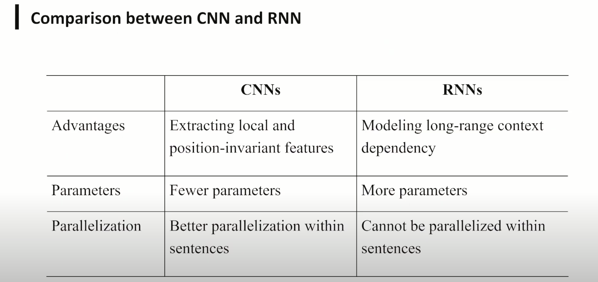
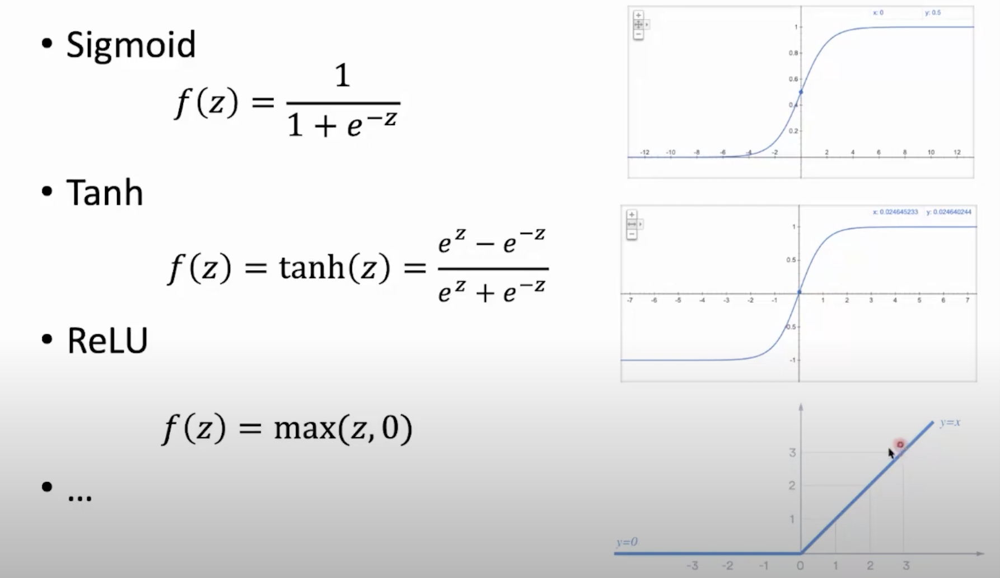

## 一 工具
1. [code GPT](https://artificialcorner.com/p/the-best-gpts-for-programmers?ref=dailydev)

2. [ai-apps](https://www.ai-apps.com.cn/)

3. [ai站点/工具](https://www.toolify.ai/)

GPT Prompt:6要素.任务task、上下文context、示例exemplar、角色persona、格式format和语气tone

### 3. [15+开发者AI工具](https://www.marktechpost.com/2024/05/03/15-ai-tools-for-developers-2024/)
 [AI code tools](https://www.builder.io/blog/best-ai-coding-tools?ref=dailydev)
- [groq](https://groq.com/)
- [phind](https://www.phind.com/)
- [perplexity](https://www.perplexity.ai/)
 1. [GitHub Copilot](https://github.com/features/copilot)
 2. [codewhisperer](https://aws.amazon.com/codewhisperer/) 
 3. [notion](https://www.notion.so/)
 4. [stepsize](https://www.stepsize.com/)
 5. [mintlify](https://writer.mintlify.com/)
 6. [Pieces for Developers](https://pieces.app/)
 7. [langchain](https://langchain-langchain.vercel.app/)
 8. [you](https://you.com/)
 9. [agentgpt](https://agentgpt.reworkd.ai/)
 10. [jam](https://jam.dev/)
 11. [durable](https://durable.co/)
 12. [tryleap](https://www.tryleap.ai/)
 13. [assemblyai](https://www.assemblyai.com/)
 14. [Microsoft Designer](https://designer.microsoft.com/)
 15. [superagi](https://superagi.com/)
 16. [replicate](https://replicate.com/)
 17. [huggingface](https://huggingface.co/)
 18. [pinecone](https://www.pinecone.io/)
 19. [midjourney](https://www.midjourney.com/home)
 20. [character.ai](https://character.ai/chat)

 - [樱桃茶](https://new.cherrychat.org/home)
 - [AI导航](https://ai.itzb.net/)
 - [设计开发导航](https://toolhunt.vercel.app/home#)

 ### 4. 视频生成
 - CogVideoX

- Mochi 1

- LTX Video

- Pyramid Flow
 ## 二 其它
  1. 卷积神经网络CNN
属于图像识别算法
卷积:数学方法提取出图像特征
NPU:神经网络处理器
卷积核   特征图:相乘再相加
池化,激活
GeoGebra制作神经网络
2. 规划问题
线性规划:单纯形法,内点法
混合整数规划
非线性规划

## 三 LLM
[MMLU（大规模多任务语言理解）能力测试dataset](https://paperswithcode.com/dataset/mmlu)
Knowledge density:知识密度
### 3.1 How do LLMs learn knowledge?
1. Self-supervised Pre-training
2. Supervised Fine-tuning
3. (reinforcement) Learning from Human Feedback (RLHF)

### 3.2 Emergent(涌现) Abilities
1. In-Context Learning
2. Instruction Following
3. Chain-of-Thought

### 3.3 未来趋势
1. Science in Artificial Intelligence: AI科学化
2. Intelligence Computing System
3. Widespread(广泛) Applications across Various(各种各样的) Domains: 更加广泛的应用

## 3.4 训练方法
ELMo:Contextualized Pre-training Start Here

## 四 神经网络

RNN:Recurrent 循环(递归)神经网络.不具有记忆能力
LSTM:长短期记忆网络
SVM:支持向量机
GAN:生成对抗网络
CNN:卷积神经网络（convolutional neural network）,图像用的比较多

Transformer:最初解决机器翻译问题. 用attention代替RNN. 现在更多 Decoder-only Models.

Transfer Learning(迁移学习),Self-supervised Learning(自监督学习) and Pre-training

激活函数:

最小化损失函数:梯度下降法

前向传播:将训练样本输入网络架构以误差值(损失函数)获得对应输出
反向传播:将输出与标准答案计算以更新权重并反复执行直到误差低于设定值
### 4.1 基本神经网络模型
感知器(Perceptron)
前馈神经网络(Feedforward Neural Network):多了隐藏层
径向基函数神经网络(Radial Basis Function Neural Network):启动函数利用径向基函数
深度前馈神经网络(Deep):多层隐藏层. 后来引入 反向传播算法(Backpropagation),构成现代机器学习系统的核心. 也即 多层感知机(multilayer perceptron,MLP)

#### 1. 常见启动函数(属于单一输入(输入与权重乘积和)单一输出形态)
1. Sigmoid函数:也叫Logistic函数,用于隐藏层神经元输出,取值范围(0,1),可以将一个实数映射到(0,1)的区间,用来做二分类
- 优点:压缩数据.适合用于前向传播
- 缺点:梯度消失(Gradient vanishing). 函数输出非Zero-centered
2. Hyperbolic Tangent(Tanh)函数: 也叫双曲正切函数,取值范围[-1,1].解决了输出非Zero-centered问题
3. Rectified linear unit(Relu)函数
线性整流函数,是一个取最大值函数.输入<0时,输出为0. 输入>0时,输出等于输入
- 优点: 收敛速度远快于Sigmoid 和 Tanh. 输入正数时,解决梯度消失问题
- 缺点: 函数输出非Zero-centered
