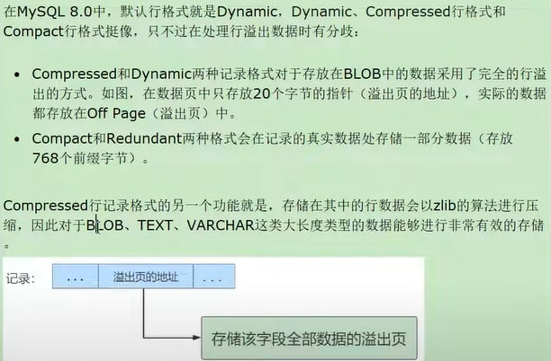

sql优化: https://www.eversql.com/?utm_medium=organic&utm_source=ext_blog&utm_content=ftisiotwebsite

比较规则:
_ai | accent insensitive | 不区分重音
-|-|-|
_as | accent sensitive | 区分重音
_ci | case insensitive | 不区分大小写
_cs | case sensitive | 区分大小写
_bin | binary | 以二进制方式比较

查询优化器配置：SELECT @@optimizer_switch
① in和exists区别
1）IN查询在内部表和外部表上都可以使用到索引。
2）Exists查询仅在内部表上可以使用到索引。
3）当子查询结果集很大，而外部表较小的时候，Exists的Block Nested Loop(Block 嵌套循环)的作用开始显现，并弥补外部表无法用到索引的缺陷，查询效率会优于IN。
4）当子查询结果集较小，而外部表很大的时候，Exists的Block嵌套循环优化效果不明显，IN 的外表索引优势占主要作用，此时IN的查询效率会优于Exists。
5）表的规模不是看内部表和外部表，而是外部表和子查询结果集
## 1. explain
### 1. type: 
system:表只有一行记录
const:通过索引一次就找到.用于比较 主键或唯一索引
eq_ref: 连接查询. 常见于主键或唯一索引
ref: 普通索引
### 2. ref
索引的哪一列使用了
### 3. rows
需要遍历的行数
### 4.extra
Using temporary: 分组时未用到索引.一般出现时Using filesort也会出现. 
## 2.索引优化
查询优化可以分为物理查询优化和逻辑查询优化.
物理查询优化通过索引和表连接方式
逻辑查询优化通过sql等价变换

一个索引可以包括16个字段
is null可以使用索引,is not null,not like 无法使用索引
or 前后字段都有索引时,可以使用2个. 只有1个索引时,无法使用索引
字符集转换 会导致索引失效
1. group by...order by需要建立联合索引
2. is null可以使用索引,is not null不使用索引
3. distinct字段需要创建索引
4. 使用字符串前缀创建索引
count(distinct left(列名，索引长度))/count(*)
越接近1越好
使用索引列前缀方式无法支持使用索引排序，只能使用文件排序
5. 区分度高(散列性高)的列适合作为索引。即列的基数大
count(distinct a)/count(*) 计算区分度。越接近1越好，一般超过33%就算是比较高效的索引
6. 单表索引不超过6个
### 1.单表优化
1. sample
```sql
where cid=1 and comments>1 order by views desc limit 1;
```

可以建立cid和views的复合索引优化. 
```sql
alter table a add index idx_cv(cid,views)
```
### 2.关联查询优化
内连接时,如果连接条件只有一个字段有索引,则有索引字段所在的表会被作为被驱动表

内连接时,MySQL会自动把小结果集的表选为驱动表,所以大表的字段最好加上索引.
左连接时,左表会全表扫描,所以右边大表字段最好加上索引.右连接同理

straight_join 强制内连接 连接方式为左表join右表
join慢,可以改大join_buffer_size默认256k
explain结果extra字段有Block nested loop(mysql 5.7使用. mysql 8.0为hash join)时,尽量不要用join
```sql
 select t1.b,t2.* from t1 straight_join t2 on (t1.b=t2.b) where t2.id<=100;
 -- t1,t2数据相同时,t1表做驱动表更好(看查询条件.只有1个字段t1.b需要放join_buffer) 
```
1. 保证被驱动表的join字段创建索引. (过滤后条件区分是否小表)
2. 需要join的字段,数据类型保持绝对一致
3. left join时,选择小表驱动大表. 减少外层循环的次数
4. inner join时,mysql会自动将小结果集的表选为驱动表.选择相信mysql优化策略
5. 能够直接多表关联的尽量直接关联,不用子查询.减少查询趟数
6. 不建议使用子查询,建议将子查询sql拆开,结合程序多次查询,或使用join代替子查询
7. 衍生表建不了索引. (create table ... as)
### 3.不适合创建索引
1. where,group by,order by使用不到的
2. 数据量小的表
3. 大量重复数据的列.重复度高于10%.
4. 避免对经常更新的表创建过多索引
5. 不建议用无序的值作为索引
6. 删除不再使用或很少使用的索引
7. 不要定义冗余或重复的索引
### 4. 子查询优化
建议使用join代替. 子查询需要建立临时表,临时表不能建立索引
### 5. 排序优化
可以在where子句和order by子句中使用索引,目的是在where子句中避免全表扫描,order by子句避免使用filesort排序.(过滤后数量不多时,filesort性能可能更好,不一定必须优化)

尽量不要使用not in 或not exists,用left join xxx on xxx where xx is null代替 

where 和 order by子句 前后顺序可以反转,可以使用索引

对于排序,多个相等条件也是范围查询,不能使用索引.

当范围条件和[group by或order by]的字段出现二选一时,优先观察条件字段的过滤数量.如果过滤的数据足够多,而需要排序的数据并不多时,优先把索引放在范围字段上.反之亦然
> fileSort算法: 
- 4.1前使用双路排序. 
- 4.1后使用单路排序. 内存占用大,性能好
> 可以调整:
>
> 1.sort_buffer_size,默认1M. 超出会创建tmp文件
>
> 2.max_length_for_sort_data. 大于时使用双路

order by时select *是大忌,最好只query需要的字段.
### 6. 分组优化
- where效率高于having, 能写在where就不要写在having
- 减少使用order by, 或将排序放到程序端
- 包含order by,group by,distinct查询的语句,where结果集保持在1000行以内
### 7. 分页查询
尽量朝主键索引靠
```sql
 select * from t,(select id from t order by id limit 200000,10) a where t.id = a.id;
```
## 3. 查看约束constraint
SELECT * from information_schema.table_constraints WHERE TABLE_NAME='user';
## 4. 外键约束
1、Cascade方式。

当update/delete记录在主表上时，同步update/delete掉从表的匹配记录。

2、Set null方式。

当update/delete记录在主表上时，从表上匹配记录的列被设置为null，但需要注意的是，子表的外键列不能是notnull。

3、No action方式。

如果子表中有匹配记录，则不允许update/delete操作与父表相对应的候选键。

4、Restrict方法，与no action相同。

立即检查外键约束。

5、Set default模式，空白可能显示在可视化工具SQLyog中。

当父表发生变化时，子表将外键列设置为默认值，但Innodb无法识别。

推荐
on update cascade on delete restrict
## 5. 定义条件与处理程序
1. 定义条件
declare 错误 condition for 错误码/错误条件
2. 处理程序

1062: mysql_error_code
```sql
declare exit/continue/undo handler for 1062 set @sv=-1;
```
## 6. 流程控制
循环结构：loop ， while...do
repeat ... until... 相当于 do while循环
## 7. MySQL 8
1. check约束

2. DDL原子化

3. 计算列 int generated always as(a+b) virtual
重启后自增不重置，写在redo_log. mysql 5.7重启后，自增会重置，保存在内存。 （删除后重启，8显示为主键不连续）

4. 全局变量持久化persist

5. 内部临时表的默认存储引擎由memory改为tempTable

6. 窗口函数
作用类似于分组函数。不合并结果，数据多少条就有多少结果

select 窗口函数 over 条件(相当于where后条件)

7. 公用表表达式CTE(common table compressions)
可以多次调用.子查询不能多次调用
- 普通：  with 名称 as 表达式
- 递归：  with recursive  名称 as 表达式

8. 支持降序索引。查看索引定义可以看到。

9. 隐藏索引visible，invisible。软删除。用于验证删除索引的影响。 其内容仍然和正常索引一样实时更新
## 8. 存储过程与存储函数
存储过程 procedure， 调用call
存储函数 function ， 调用select 
## 9. 游标cursor
cursor for 
open
fetch
close
## 10. 触发器trigger
条件insert/update时可以使用new，delete可以使用old表示表中已经存在的记录
```
create trigger ... 
before/after insert/update/delete on 表
for each row
条件
```
自定义错误
```
then signal sqlstate 'HY000' set message_text="高于a"
```
## 11. 文件系统
var/lib/mysql/ibdata1 系统表空间,默认12M,会增长

innodb: MySQL8.0开始, 数据库文件只有 .ibd(5.7有.opt,.frm,.ibd)
myisam: MySQL8.0, .sdi,.MYD,.MYI( 5.7有.opt,.MYD,.MYI)

## 12.权限
``` sql
flush privileges;  //刷新权限
```
WITH GRANT OPTION :给其它用户赋权限
``` sql
// 赋予所有权限. 
GRANT ALL PRIVILEGES ON *.* TO 'abc'@'%' WITH GRANT OPTION 
``` 
查看指定用户权限
```
show grants for 'abc'
```
revoke回收权限
revoke 权限1,... on 数据库.表 from 用户@用户地址
``` sql
# MYSQL 8 查看角色是否激活
SELECT CURRENT_ROLE()

# 激活角色
set default role all/角色@地址 to 用户@用户地址
```
## 13. MySQL逻辑架构
连接层(连接池),服务层(sql接口,parser解析器,optimizer优化器,caches&buffers(MySQL8取消)),引擎层

query_cache_type参数设置查询缓存

1. 存储引擎
- myisam适合小表, insert和 select性能更好.只缓存索引.崩溃后无法安全恢复
- ARCHIVE引擎. 只支持插入和查询. 采用行级锁.使用zlib压缩库.支持备份/时间点恢复(在服务器中实现,而不是在存储引擎中).MySQL5.5后支持自增列索引. 
- BLACKHOLE引擎.丢弃所有插入的数据,服务器会记录blackhole表的日志
- csv引擎. 
> 可以将普通csv文件作为MySQL的表处理,但不支持索引. 不支持空列
> 可以作为一种数据交换的机制,非常有用
> 对于数据的快速导入导出有明显优势
> .csm存储元数据,.csv存储数据
- MEMORY引擎
> .frm存储表结构.数据存储在内存
> 存储的数据是数据长度不变的格式
> 同时支持hash索引和B+树索引.默认hash索引
> 表大小受限制
- FEDERATED引擎.访问远程表. 经常带来问题,默认禁用
- MRG_MYISAM引擎.管理多个myisam表的集合
- NDB引擎.也叫NDB Cluster引擎.MySQL集群专用.支持hash索引

空间列类型索引使用R-树


## 14. MySQL性能分析
1. [MySQL调优性能监控之performance schema](https://learnku.com/articles/62427)
```sql
-- 获取平均响应时间最长的前10个 SQL 语句
SELECT 
    DIGEST_TEXT AS SQL语句,
    ROUND(SUM(TIMER_WAIT) / COUNT_STAR, 2) AS 平均响应时间
FROM 
    performance_schema.events_statements_summary_by_digest
WHERE 
    SCHEMA_NAME NOT IN ('performance_schema', 'information_schema', 'mysql')
    AND COUNT_STAR > 10  -- 可以根据实际情况调整阈值
GROUP BY 
    DIGEST_TEXT
ORDER BY 
    平均响应时间 DESC
LIMIT 
    10;  -- 获取平均响应时间最长的前10个 SQL 语句


```

## 15. MySQL索引
目的: 减少磁盘IO次数
索引在存储引擎中实现

聚集索引不是单独的索引类型,而是一种数据存储方式

### 1. B+ 树索引
1. 根页面位置始终不动. 先生成根节点,再生成下面的节点
2. 内节点(非叶子节点)中目录项记录的唯一性
3. 一个页面最少存储2条记录

myisam只有非聚簇索引.可以没有主键,建议设置主键

innoDB提供自适应hash索引(Adaptive Hash Index).默认开启

AVL(Balanced Binary Tree)树,平衡二叉搜索树:它是一棵空树或它的左右两个子树的高度差的绝对值不超过1,并且左右2个子树都是一棵AVL树

B-Tree(Balance Tree),多路平衡查找树.非叶子节点也存放数据.需要中序遍历才能拿到所有数据

B+树非叶子(中间)节点不存储数据.存储主键,叶子节点的指针.高度一般在2-4层,因为innodb根节点常驻内存,查找行记录只需要1-3次磁盘io

> hash索引不支持范围查询,不支持联合索引的最左侧原则,不支持order by排序,不支持模糊查询

R-Tree,仅支持geometry数据类型.仅myisam,bdb,innodb,ndb,archive支持.解决高维空间搜索问题.存储高维数据的平衡树.相对于B-Tree,R-Tree的优势在于范围查找. Memory引擎不支持

### 2.全文索引
支持 char，varchar，text类型。
match(title,content) against('查询字符串')。比like快，可能存在精度问题

## 16. innodb页
### 1. 页的上层结构
存储结构从大到小:表空间(Tablespace)-->段(segment)-->区(extent)-->页(page)

顺序io
区(Extent)是比页大一级的存储结构,一个区会分配64个连续页.一个区的大小是64*16kB=1MB
区分为:free,free_frag(有剩余空间的碎片区),full_frag(没有剩余空间的碎片区)(以上3种直属于表空间),fseg(附属于某个段的区)

段是数据库中的分配单位,不同类型的数据库对象以不同的段形式存在.在段中不要求区相邻.常见的段有数据段,索引段,回滚段.是逻辑上的概念,由若干零散的页面以及一些完整的区组成

碎片区(fragment)直属于表空间
刚插入数据时,段是从某个碎片区以单个页面为单位分配存储空间.当某个段已经占用了32个碎片区页面后,就申请以完整的区为单位分配存储空间

表空间是一个逻辑容器.表空间从管理上可以划分为系统表空间,用户表空间,撤销表空间,临时表空间等
innodb_file_per_table=on,表示独立表空间

MySQL5.7新建表,.idb文件默认占用96kB(6页)
### 2. 页的内部结构
按类型划分,常见的有 数据页(保存B+树节点),系统页,undo页,事务数据页等

名称        |占用大小|说明|
---|-|-
File Header | 38B| 文件头,描述页信息
Page Header | 56B | 页头,页的状态信息
Infimum+Supremum|26B|最大和最小记录,这是2个虚拟的行记录
User Records | 不确定 | 用户记录,存储行记录内容
Free Space | 不确定 | 空闲记录,页中还没有使用的空间
Page Directory | 不确定 | 页目录,存储用户记录的相对位置
File Trailer | 8B | 文件尾,校验页是否完整

#### 1. 行格式
建表指定行格式. row_format=compact

1. compact(紧凑)行格式. 变长字段长度列表(插入逆序),null值列表,记录头信息,记录的真实数据. 
记录的真实数据还会有3个隐藏列

列名 | 是否必须 | 占用空间 | 描述
-|-|-|-
row_id | N | 6B | 行id
transaction_id | Y | 6B |
roll_pointer | Y | 7B | 回滚指针

2. dynamic 和 compressed 格式

varchar(65535) 默认长度21845字符.指定charset=ascii时,最大长度: not null时,变长字段长度占2B,实际可用65533. 可空时,需要1B的null值标识,实际可用65532.

行溢出. 一页16KB,即16384B. 一页存放不下1条记录称为行溢出



3. redundant(冗余)格式
字段长度偏移列表(逆序),记录头信息(record header)
MySQL5.0之前默认

## 17.性能分析工具

``` sql
--上次查询的页数量
show status like "Last_query_cost";
--慢查询数
show status like "slow_queries";
--扫描过的最小记录数.默认0. 下面2个一起判别慢查询
show VARIABLES like "min_examined_row_limit";
show VARIABLES like "long_query_time";
```
```sh
#查询 慢查询日志查询时间排名前5的
mysqldumpslow -s t -t 5 .log 
# 重新生成日志文件
mysqladmin -uroot -p flush-logs slow
```
### 1. show profile


### 2. explain
1. type: 针对单表的访问方法。
or 的字段都有索引，会使用 index_merge
> 主键或唯一索引与常数等值匹配时,const
> 普通索引等值匹配，ref。 隐式转换会变成all
> 从好到坏：`system>const >eq_ref>ref` > `fulltext>ref_or_null>index_merge>unique_subquery>index_subery` > range>index>all
2. key_len: 查看联合索引使用。
null 占1B，varchar需要+3B（变长2B,null占1B）
3. rows: 预估读取记录数。越小越好
4. extra:
5. id：select个数。少于，优化器优化。id越大，优先级越高，越先执行。 id数越少越好
6. filtered： 越高越好。 连接查询需要关注。
#### 1. 显示格式
传统格式，
json格式，信息更丰富. explain format=json
tree格式，
可视化输出:MySQL workbench

### 3. show warnings: 查看优化后的sql语句
### 4. 分析优化器执行计划: Optimizer Trace
MySQL5.6引入.默认关闭. 
结果保存在INFORMATION_SCHEMA.OPTIMIZER_TRACE表
```sql
SET optimizer_trace="enabled=on",end_markers_in_json=on;

set optimizer_trace_max_mem_size=1000000;
```
### 5. sys schema监控分析视图
MySQL5.7.7新增.整合performance_schema和information_schema.降低查询performance_schema的复杂度
生产环境不要频繁查询这3个表.消耗大量资源
```sql
# 查询冗余索引
SELECT * from sys.schema_redundant_indexes;

# 查询未使用索引
SELECT * from sys.schema_unused_indexes;

# 查询行锁阻塞
SELECT * from sys.innodb_lock_waits;
```
## 30. 一致性
MySQL保证的一致性是：在一个事务中的DML（增删改）操作
不一致场景与mysql解决方案:
1. 并发冲突. 加锁
2. redolog不完整.
InnoDB是通过「双写缓冲」、「Redo Log」等机制保证数据不丢失的. 事务执行中宕机,通过undolog解决
3. binlog&redolog不一致

## 31. 存储过程
1. 插入数据
```sql
DELIMITER //
CREATE PROCEDURE idata()
BEGIN
    DECLARE i INT;
    SET i=1;
    WHILE(i<=1000)DO
        INSERT INTO t2 VALUES(i,i,i);
        SET i=i+1;
    END WHILE;
END //
DELIMITER ;
CALL idata();
```
## 32. mysql优化

