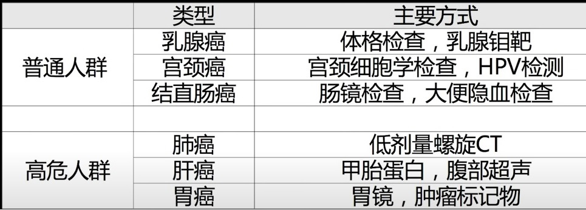
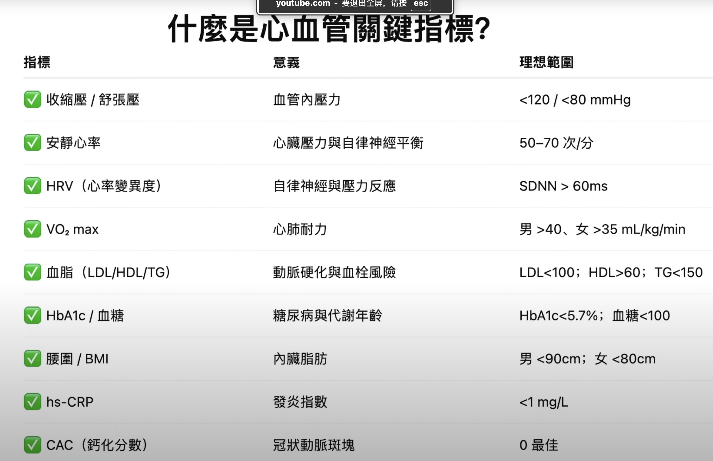

万能炒菜公式
勾芡：加点水淀粉让汤汁包裹食材。

收汁：大火把水分炒干，提升风味

人体5大(常量)元素: C, H, O, N, Ca(1.5-2%) 

心脏病:动脉粥样硬化

长寿四大敌人:代谢功能障碍、心脑血管疾病、癌症和阿兹海默症

人生最好的六個醫生：陽光、運動、睡眠、飲食、自信、朋友

医学3.0
- 运动:有氧运动(间歇运动),力量训练
- 营养:热量,饮食(营养素),时间限制
- 睡眠
- 情绪
- 外源性分子

[健身](https://www.mayoclinic.org/zh-hans/healthy-lifestyle/fitness/in-depth/core-strength/art-20546851)

下列预包装食品可以免除标示保质期：酒精度大于等于10%的饮料酒；食醋；食用盐；固态食糖类；味精

[健康饮食](https://www.who.int/zh/news-room/fact-sheets/detail/healthy-diet)

[合理营养](https://www.thepaper.cn/newsDetail_forward_25112544)

1. [瘦腹部](https://www.msn.com/zh-cn/news/other/%E5%A6%82%E4%BD%95%E7%94%A9%E6%8E%89%E8%85%B0%E8%85%B9%E9%83%A8%E7%9A%84%E8%B5%98%E8%82%89-%E8%BF%996%E4%B8%AA%E5%8A%A8%E4%BD%9C-%E8%AE%A9%E4%BD%A0%E7%94%A9%E8%84%82%E5%A1%91%E5%BD%A2-%E5%B9%B3%E5%9D%A6%E8%85%B9%E9%83%A8/ar-AA1Czcti?ocid=msedgntp&pc=U531&cvid=e56d4d1517eb4a2084b415d0dba93ec1&ei=37)
> 平板支撑：打造核心力量的基础  
> 俄罗斯转体：精准打击侧腹脂肪  
> 仰卧卷腹：传统但有效的选择  
> 反向卷腹：下腹部的克星  
> 登山者式：全身燃脂的复合动作  
> 死虫式：改善核心稳定性的秘密武器

2. 抗衰运动
> 俯卧撑
> 深蹲
> 臀桥
> 仰卧起坐
> 心血管.有氧运动(跳舞,快步走)
> 划船

白藜芦醇,多酚
## 1.癌症
失控生长:化疗,放疗
基因突变:靶向疗法
免疫逃逸:免疫疗法

[儿童癌症](http://www.curekids.cn/)
1. 肺癌
鳞癌,小细胞癌(也叫燕麦细胞癌,放疗为主),腺癌(女性,放化疗不敏感.基因抑制类药物),细支气管肺泡癌(BAC),大细胞癌(手术切除机会大)
早筛使用肺部增强螺旋CT检测,检测是否肺外转移使用PetCT
## 2. 正确的运动方式
每个人的起点和终点不一样，所以训练计划也不一样。训练计划要考虑运动类型、时间和频次三个维度。开始运动前充分热身，防止受伤。

1. **Zone2训练**，指有氧运动的强度区间。此时心率处于最大心率的70%到85%，可以勉强边运动边说话。在这个强度下，线粒体会变多，变强。每周至少进行三次Zone2训练，每次45分钟。运动过程中，强度尽量保持在Zone2，并逐步增加阻力。

2. [**高强度间歇训练HIIT**](https://sspai.com/post/76004)，训练目的是提高最大摄氧量。每周至少进行一次，每次使用“4x4x4”的方式 — 最大强度跑4分钟，慢走休息4分钟，重复4次循环。有条件的话，每年可以去实验室测试一次最大摄氧量。

3. **力量训练**，关注锻炼大肌群的重训动作，并且有针对性的增加手部握力，和提高对髋关节的控制。推荐农夫走、硬拉、深蹲和蹬台阶训练。训练过程中学会控制肌肉的收缩和拉长，以及通过协调的呼吸提高脊柱稳定能力。每周至少练三次，建议一开始跟专业教练，保证动作的准确性。

## 2. 医学
1. 哮喘: 过敏性,心源性
2. COPD:慢性阻塞性肺疾病

## 3. 建议
>1. 坚持运动,一周3-5次，30分钟以上，推荐挥拍运动、游泳🏊室内有氧运动，跳操、舞蹈、瑜伽
>2. 戒烟
>3. 不经常喝酒，最好是0喝酒,喝白开水
>4. 健康饮食，豆类全谷坚果蔬菜水果，增加粗粮，白肉，减少红肉精米精面，适量坚果奶类，以蒸煮烹饪为主，少煎炸
>5. 规律睡眠，23点前入睡
>6. 保持好心情,养生重在养心
>7. 积极社交
>8. 不滥用药物

## 4. 心血管

## 5. 《〈营养圣经〉至今仍然实用的20条原则》
| 序号   | 核心原则            | 现代科学依据          | 实践与食物示例               |
| ---- | --------------- | --------------- | --------------------- |
| 1️⃣  | **吃食物，而不是“产品”** | 加工食品与代谢病显著相关    | 自炊饭菜、少包装零食            |
| 2️⃣  | **多样化饮食**       | 多样化→营养全面、肠道菌群丰富 | 五色蔬菜+不同蛋白来源           |
| 3️⃣  | **每天吃蔬菜水果**     | 抗氧化、降血脂、防癌      | 至少5份蔬果，彩色越多越好         |
| 4️⃣  | **保持全谷优先**      | 全谷含膳食纤维、维B群、镁   | 燕麦、糙米、全麦面包            |
| 5️⃣  | **减少精制糖**       | 过量糖→脂肪肝、胰岛素抵抗   | 不喝含糖饮料、少甜点            |
| 6️⃣  | **控制盐摄入**       | 高盐→高血压、肾负担      | 烹调少盐、避免咸菜腊肉           |
| 7️⃣  | **好脂肪替代坏脂肪**    | 不饱和脂肪保护心脏       | 橄榄油、核桃、深海鱼            |
| 8️⃣  | **适量蛋白质，优质为主**  | 优质蛋白→肌肉维持、免疫增强  | 蛋、鱼、豆腐、牛奶             |
| 9️⃣  | **多吃富含膳食纤维食物**  | 改善肠道菌群、控糖控脂     | 豆类、燕麦、地瓜、蔬菜           |
| 🔟   | **维生素主要从食物获取**  | 食物中协同吸收更佳       | 吃新鲜食物、少依赖保健品          |
| 11️⃣ | **饮食与情绪健康相关**   | 肠脑轴研究证实         | 保持规律饮食、摄入Omega-3      |
| 12️⃣ | **控制总热量**       | 过量热量→肥胖与慢性病     | 吃八分饱，细嚼慢咽             |
| 13️⃣ | **定时定量，不暴饮暴食**  | 稳定血糖、保护消化系统     | 固定三餐，少夜宵              |
| 14️⃣ | **多喝水，少饮料**     | 水是代谢介质          | 白开水、淡茶、避免果汁汽水         |
| 15️⃣ | **少酒或不饮酒**      | 酒精损肝、升血压        | 偶尔少量红酒可接受             |
| 16️⃣ | **保持规律运动**      | 提升胰岛素敏感度        | 每天30分钟步行/骑行           |
| 17️⃣ | **保证睡眠与休息**     | 睡眠不足→代谢紊乱       | 每晚7小时以上               |
| 18️⃣ | **维持健康体重**      | 肥胖是多种疾病根源       | BMI 18.5–23.9，腰围<90cm |
| 19️⃣ | **少吃油炸与烟熏食物**   | 含致癌物（丙烯酰胺、多环芳烃） | 烤、炖、蒸代替煎炸             |
| 20️⃣ | **心态与饮食并重**     | 压力会影响营养吸收       | 放松、社交、享受进食            |

### 1. 书中几条“旧理论”的现代修正
| 原版观点       | 现代结论                |
| ---------- | ------------------- |
| 高蛋白会导致骨质疏松 | ❌ 钙足够时不会；反而可促进骨骼强度  |
| 少吃脂肪       | ❌ 区分脂肪类型才关键         |
| 维生素越多越好    | ❌ 过量补充（A、D、E、K）可能中毒 |
| 排毒饮食有奇效    | ❌ 没科学证据，肝肾才是排毒器官    |

## 6. 478呼吸法快速入睡（吸气4s，屏住呼吸7s，用嘴呼气8秒），3-5次