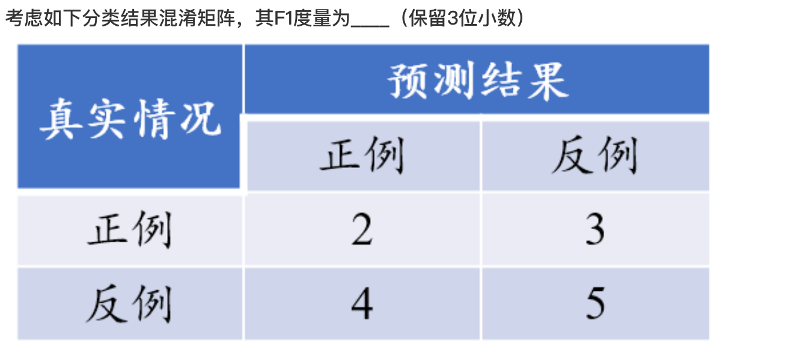

## 科学技术工程应用
科学探索事物的原理（为什么）
技术解决实现方法（怎么做）
工程关注效率与成本（怎么样做得多快好省）
应用则聚焦于实际操作与效果展现（做什么）

## 入门方法
1. 通读，速读：快。知道存在，有什么。观其大略
2. 关键点。提纲挈领
3. 细思。疏通经络

## 术语
分类：离散的输出
回归：连续的输出

定义：智能数据分析

 NFL定理（No Free Lunch）：算法选择
 统计机器学习（早期有符号）的假设：独立同分布

 奥卡姆剃刀原则（Occam's Razor，又称“如无必要，勿增实体”）的核心是：在解释相同现象、预测能力大致相同的多个假设中，应该优先选择假设最少（或引入实体/前提最少）的那个。只在“两个假设解释力和预测力完全相同”时才适用，只是启发式偏好（heuristic）

但是：两个假设到底哪一个“更简单”，往往是不容易判断的。

理论模型；PAC（probably Approximately Correct，概率近似正确）
过拟合（overfitting），欠拟合（underfitting）

3大关键问题：评估方法，性能度量，比较检验

## 1. 基础
### 1. 分类
- 监督学习(Supervised Learning)：分类，回归
- 无监督学习(Unsupervised Learning)：聚类
- 强化学习(Reinforcement Learning,增强学习)：奖励/惩罚
- 半监督学习(Semi- supervised Learni)
- 深度学习(Deep Learning)

### 2. 模型评估与选择
# 经验误差、测试误差与泛化误差对比

| 概念         | 英文常用说法                              | 用哪个数据集计算？              | 含义（通俗解释）                                      | 能不能直接看到它的值？       | 它和真实泛化能力的关系                  |
|--------------|-------------------------------------------|----------------------------------|-------------------------------------------------------|-------------------------------|------------------------------------------|
| **经验误差** | Training error / Empirical error / Empirical risk | 只用**训练集**计算              | 模型在**已经见过的数据**上的平均错误（训练集表现）   | 是（训练完就能算）           | 通常**比真实泛化误差小**（乐观偏差）    |
| **测试误差** | Test error                                | 用**独立的测试集**计算          | 模型在**没见过的数据**上的平均错误（这次实验的估计） | 是（测试完就能算）           | 是对**泛化误差**的一次采样估计，有随机性 |
| **泛化误差** | Generalization error / Expected error     | 理论上用**整个数据总体（无限多新样本）**计算 | 模型对**所有可能的新样本**的期望错误（真正关心的东西） | **不能直接看到，只能估计**   | 这是我们真正想知道的值                  |

### 极简一句话总结

- **经验误差**：像期中考试成绩，只考已经教过的题 → 总是显得太好（乐观）
- **测试误差**：用一套新出的模拟卷子测一次的分数 → 接近真实水平，但有随机波动
- **泛化误差**：这门课你真实水平到底多少分（所有可能的考试题平均） → 永远看不到，只能靠估计

### 留一法中常见误差相关写法对比

| 写法                  | 完整含义                          | 常见出现的地方                          | 备注                                                                 |
|-----------------------|-----------------------------------|-----------------------------------------|----------------------------------------------------------------------|
| **O(测试)误差**       | Out-of-sample 测试误差            | 周志华《机器学习》笔记、CSDN、知乎等中文博客 | 最常见的简写，尤其在讨论留一法时                                      |
| **样本外误差**        | Out-of-sample error               | 统计学习、风险估计相关讨论              | 更直白的翻译                                                         |
| **LOOCV 误差**        | Leave-One-Out CV 的平均误差       | 教材、论文                              | 直接用方法名                                                         |
| **泛化误差估计**      | Estimate of generalization error  | 更正式的学术讨论                        | LOOCV 被视为泛化误差的近似无偏估计                                   |

### 补充说明

- “O(测试)误差” 中的 **O** 来自 **Out-of-sample**（样本外），是中文机器学习社区讨论留一法（LOOCV）时特别常用的简写。
- 它特指每次留出的那个“未参与训练的测试样本”上的预测误差。
- 在留一法中，由于每次训练集几乎等于全数据集，这种 O(测试)误差的平均值被认为是泛化误差的**几乎无偏估计**（bias 极低）。

英文里更常用完整说法：
- leave-one-out error
- LOOCV error
- out-of-sample error
- cross-validation error（特指 LOOCV 时）

数据少 + 模型鲁棒 → 自助法最香（训练够大 + OOB（Out-of-Bag,包外估计）免费测 + 评估最稳）

数据少 + 模型娇气 → 优先 LOOCV（Leave-One-Out Cross-Validation,留一法） 或 5/10 折 CV（k折交叉验证 (k-fold CV)，尽量保持分布不变）

当我们使用留一法（Leave-One-Out Cross-Validation）进行评估时，最典型、最常被指出的问题是：
1. 经验误差与泛化误差偏差大(强调“训练误差低估风险、过拟合被放大”)
2. 计算代价极高（需要训练 n 次模型，n 很大时不可行）
3. 方差较高（虽然 bias 低，但不同折之间的测试误差波动可能较大，因为测试集每次只有 1 个样本）
4. 强调留一法得到的模型与最终模型不一致时，训练模型与使用整个数据集训练的模型差异大（LOOCV评估的是n个“n-1样本模型”的平均表现，而最终模型是用n样本训练的，两者模型本身不同）

### 常见数据集划分 / 性能评估方式对比（小数据场景重点）

| 方法                  | 训练集大小（相对原数据）       | 测试样本利用率          | 是否改变数据分布          | 小数据场景表现 | 对分布变化的敏感度          | 主要缺点/限制                              | 适用场景总结                              |
|-----------------------|--------------------------------|-------------------------|---------------------------|----------------|-----------------------------|--------------------------------------------|-------------------------------------------|
| **留出法** (hold-out) | ≈ 70–80%                      | 低（只用一次划分）      | 基本不变                  | 较差           | 低                          | 数据少时训练/测试都严重不足，随机性大     | 数据量很大时才稳                          |
| **k折交叉验证** (k-fold CV) | ≈ (k-1)/k ≈ 80–90% (k=5/10) | 高                      | 基本不变                  | 中等           | 中等                        | k较大时计算开销大；小数据仍有随机划分影响 | 数据量中等，追求稳定评估                  |
| **留一法** (LOOCV)    | n-1 / n ≈ 几乎100%            | 最高                    | 基本不变                  | 较好           | 低                          | 计算代价极高（需训 n 次模型）             | 数据极少（几十到几百），模型训很快        |
| **自助法** (Bootstrap) | ≈ 63.2%（平均）               | 中等（OOB ≈36.8%）      | **有变化**（有放回，重样） | **最好**       | **低**（前提是任务本身鲁棒） | 人为引入分布偏移；重复样本可能放大噪声    | **数据少 + 模型对轻微分布变化鲁棒**      |

#### 1. 自助法Bootstrap的基本原理（核心一句话）

>从原始数据集 D（大小为 m）中，有放回地随机抽样 m 次，得到一个新数据集 D'（大小仍为 m）。

>有些样本在 D' 中出现多次（重复）。
有些样本一次都没被抽到（约 36.8% = 1/e 的概率没被抽到，这些叫 包外样本 OOB）。

>重复这个过程很多次（通常几十到几千次），就能得到多个不同的训练集和对应的 OOB 测试集

#### 2. F1度量（也叫 F1分数、F1-score、F1值 或 F-measure）
是机器学习中最常用、最重要的分类模型评估指标之一，尤其在二分类任务和类别不平衡场景下。

它本质上是精确率（查准率,Precision） 和 召回率（Recall） 的调和平均数（harmonic mean），而不是简单算术平均，从而在两者之间取得平衡。
核心公式（最常用的是 F1-score，即 β=1 的情况）
$$F1 = 2 \times \frac{\text{Precision} \times \text{Recall}}{\text{Precision} + \text{Recall}}$$
或等价写法：
$$F1 = \frac{2 \times TP}{2 \times TP + FP + FN}$$
其中：

- TP（True Positive）：真正例，模型正确预测为正类的正样本
- FP（False Positive）：假正例，模型错误地把负样本预测为正类
- FN（False Negative）：假负例，模型漏掉了正样本（把正样本预测为负类）
- TN (True Negative): 真阴性,预测为负，实际也是负

| | 实际为正 (Actual Positive) | 实际为负 (Actual Negative) |
| :--- | :---: | :---: |
| **预测为正 (Predicted Positive)** | TP (True Positive,真正例) | FP (False Positive,假正例) |
| **预测为负 (Predicted Negative)** | FN (False Negative,假负例) | TN (True Negative,真负例) |

F1度量 = Precision 和 Recall 的调和平均，是类别不平衡分类任务中最可靠的单一指标之一——它惩罚了“只顾查准不查全”或“只顾查全不查准”的极端模型。

在论文、竞赛、实际项目中，如果你只能报告一个数字，除了准确率（accuracy），F1 几乎总是首选（尤其正类稀少时，accuracy 很容易被误导）

TN 是计算许多评价指标的基础。如果 TN 很高，说明模型对“反面案例”的识别非常准确。

准确率 (Accuracy): 训练模型整体判断对的概率。$$Accuracy = \frac{TP + TN}{TP + TN + FP + FN}$$特异度 (Specificity): 衡量模型识别“负类”的能力。$$Specificity = \frac{TN}{TN + FP}$$注：在医学筛查中，特异度越高，误诊（把健康人判为病人）的概率就越低。假阳性率 (False Positive Rate, FPR): $$FPR = \frac{FP}{TN + FP}$$这是 ROC 曲线的横坐标，TN 越大，FPR 就越小。

### Precision（精确率）

$$
P = \frac{TP}{TP + FP}
$$

### Recall（召回率）

$$
R = \frac{TP}{TP + FN}
$$

TP = 2

FN = 3

FP = 4

TN = 5

#### 3. 选择
1. 训练模型时，选择经验误差最小的模型会存在过拟合风险。

2. 使用留出法对数据集进行划分时，为了保持数据分布的一致性，可以考虑分层采样

- 留出法（hold-out）划分时，最重要的目标之一是：训练集和测试集的分布尽可能一致（即独立同分布假设成立）。
- 随机采样在小数据集或不平衡数据集上很容易破坏这个一致性。
- 分层采样（stratified split）是目前最主流、最推荐的做法，尤其在分类任务中，几乎是默认选择

3. 要么使用独立的验证集来选模型，要么使用嵌套交叉验证，最后用独立的测试集给出可信的性能估计，再决定是否推荐。